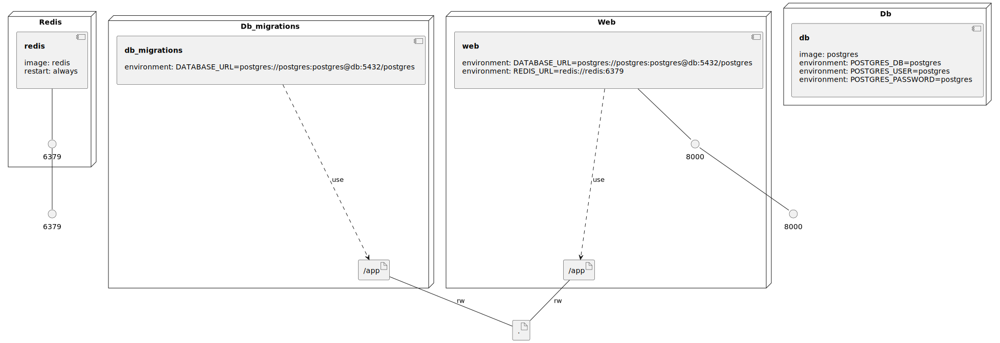

# Django + Poetry Docker Example

Multi-stage Docker build for [Django](https://www.djangoproject.com) projects using [Poetry](https://python-poetry.org).

### Infrastructure model

- [web component model](.infragenie/web_component_model.svg)

---
